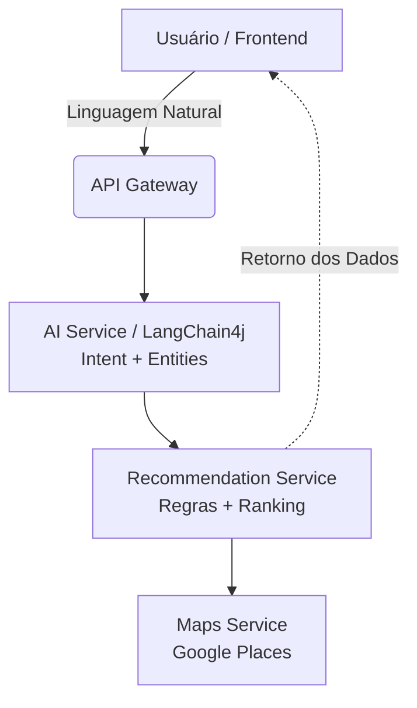

> Plataforma inteligente de assistência à jornada de saúde do usuário. Combina uma interface de **Chatbot baseada em IA** para interpretação de linguagem natural com um **Backend robusto** responsável por regras de negócio, cálculos determinísticos, persistência e gestão de estados.

---

## 📖 Visão Geral

Este projeto não é apenas um buscador de médicos, mas uma plataforma completa de gestão da jornada de saúde. O sistema evolui em camadas: começando com um assistente conversacional que recomenda profissionais baseados em geolocalização e regras de ranking, até chegar à gestão de medicamentos, histórico clínico, cuidadores e serviços de *Home Care*.

### 🧠 Princípio Arquitetural Core

| 🤖 Inteligência Artificial (AI Service) | ⚙️ Backend (Domain Service) |
| :--- | :--- |
| • Interpretação da linguagem natural<br>• Identificação de intenção<br>• Extração de entidades estruturadas<br>• Conversação e interface com o usuário | • Aplicação de regras de negócio<br>• Filtros, cálculo de distância e ranking determinístico<br>• Persistência e agendamento<br>• Recorrências, notificações e permissões |

*A IA nunca decide qual estabelecimento é o melhor ou toma decisões clínicas. Ela estrutura a intenção para que o Backend processe os dados de forma segura e controlada.*

---

## 🏗️ Arquitetura de Referência



---

## 🚀 Roadmap de Desenvolvimento (Sprints)

O projeto está dividido em **12 Fases/Sprints**, priorizadas do P0 (Fundação) ao P5 (Escala).

- [x] **Sprint 01: Chatbot MVP (P0)** - Busca por linguagem natural, extração de entidades e ranking de profissionais via Google Places.
- [ ] **Sprint 02: Usuários (P0)** - Identidade, perfil, preferências persistidas e autenticação.
- [ ] **Sprint 03: Profissionais e Favoritos (P1)** - Domínio de prestadores, clínicas, especialidades e favoritos.
- [ ] **Sprint 04: Consultas e Exames (P1)** - Histórico real de acompanhamento e timeline de saúde.
- [ ] **Sprint 05: Medicamentos (P2)** - Rotinas, registro de dosagem e controle de tomada de remédios.
- [ ] **Sprint 06: Notificações (P2)** - Rules Engine e Notification Engine para lembretes unificados.
- [ ] **Sprint 07: Home Care (P3)** - Solicitação, matching operacional e execução de atendimento domiciliar.
- [ ] **Sprint 08: Familiares (P4)** - Compartilhamento controlado de acessos com cuidadores.
- [ ] **Sprint 09: Documentos (P4)** - Centralização de arquivos clínicos e resultados de exames.
- [ ] **Sprint 10: Segurança (P5)** - Auditoria, logs (AuditLog), RBAC e Rate Limit.
- [ ] **Sprint 11: Performance (P5)** - Implementação de Redis, Circuit Breaker e Cache.
- [ ] **Sprint 12: Produção (P5)** - CI/CD, Docker, Monitoramento e Deploy final.

---

## 🛠️ Tecnologias e Módulos Previstos

*   **Linguagem & Framework:** Java, Spring Boot
*   **Inteligência Artificial:** LangChain4j, OpenAI/Local LLM
*   **APIs Externas:** Google Places API (Maps Service)
*   **Banco de Dados:** PostgreSQL (Relacional), Redis (Cache/Sessões)
*   **Arquitetura:** API Gateway, Microsserviços escaláveis sob demanda.
*   **DevOps:** Docker, GitHub Actions (CI/CD)

---

## 📜 Regras de Negócio e Governança Globais

Para garantir a segurança do usuário e a integridade do sistema, o projeto segue diretrizes rigorosas:

1. **Backend é Autoridade:** A IA nunca é a fonte definitiva da verdade dos dados. O cálculo de *score* é exclusividade do sistema.
2. **Sem Decisão Clínica:** A IA **NÃO** realiza diagnósticos, prescrições, triagem clínica ou interpretação de exames.
3. **Privacidade e Consentimento:** Os dados de saúde são estritamente controlados. O acesso por terceiros (Familiares/Cuidadores) exige consentimento explícito e granular por tipo de recurso.
4. **Situações de Emergência:** Em risco de vida, o sistema interrompe o fluxo normal e apresenta orientação clara para busca imediata de um serviço de emergência.
5. **Auditoria (Compliance):** Ações críticas (alterar medicações, permissões, conclusão de consultas) geram logs imutáveis.

---

## 💻 Como rodar o projeto localmente

```bash
# Clone o repositório
git clone https://github.com/seu-usuario/seu-repositorio.git

# Acesse a pasta do projeto
cd seu-repositorio

# Configure as variáveis de ambiente (Crie um arquivo .env com base no .env.example)
# API_KEY_GOOGLE_PLACES=...
# API_KEY_LLM=...

# Execute via Docker Compose
docker-compose up --build
```